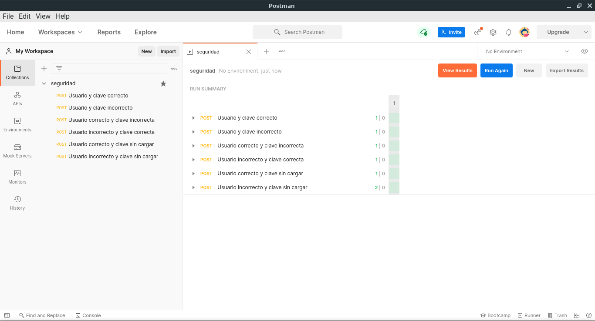

# API Test

Test de ingreso al sistema usando postman.

Al diseñar el sistema se decidió que siempre devuelva un código de resultado `200` pero cambie el contenido del mensaje.
 
## Capturas de test

Test a ejecutar:


Sumario del resultado test:



Resultado detallado de test:


## Contenido de cada test (Código)

### Usuario y clave correcto

Body (JSON):
```
{
    "id" : "admin",
    "password" : "admin"
}
```

Test:
```
pm.test("Si se pasa usuario y clave correcto", function () {
  pm.response.to.have.status(200);
  const respuesta = pm.response.json();
  pm.expect(respuesta.estado).to.eql("ok");
  pm.expect(respuesta.token).to.exist;
  pm.expect(respuesta.administrador).to.exist;
});
```

### Usuario y clave incorrecto

Body (JSON):

```
{
    "id" : "admin-error",
    "password" : "admin-error"
}
```

Test:
```
pm.test("Si se pasa usuario y clave incorrecto", function () {
  pm.response.to.have.status(200);
  const respuesta = pm.response.json();
  pm.expect(respuesta.estado).to.eql("error");
  pm.expect(respuesta.token).to.not.exist;
  pm.expect(respuesta.rol).to.not.exist;
});```

### Usuario correcto y clave incorrecta

Body (JSON):

```
{
    "id" : "admin",
    "password" : "admin-error"
}```

Test:
```
pm.test("Si se pasa usuario correcto y clave incorrecta", function () {
  pm.response.to.have.status(200);
  const respuesta = pm.response.json();
  pm.expect(respuesta.estado).to.eql("error");
  pm.expect(respuesta.token).to.not.exist;
  pm.expect(respuesta.rol).to.not.exist;
});
```
    
### Usuario incorrecto y clave correcta

Body (JSON):

```
{
    "id" : "admin-error",
    "password" : "admin"
}
```

Test:
```
pm.test("Si se pasa usuario incorrecto y clave correcta", function () {
  pm.response.to.have.status(200);
  const respuesta = pm.response.json();
  pm.expect(respuesta.estado).to.eql("error");
  pm.expect(respuesta.token).to.not.exist;
  pm.expect(respuesta.rol).to.not.exist;
});
```
    
### Usuario correcto y clave sin cargar

Body (JSON):

```
{
    "id" : "admin"
}
```

Test:
```
pm.test("Si se pasa usuario correcto y clave sin cargar", function () {
  pm.response.to.have.status(200);
  const respuesta = pm.response.json();
  pm.expect(respuesta.estado).to.eql("error");
  pm.expect(respuesta.token).to.not.exist;
  pm.expect(respuesta.rol).to.not.exist;
});
```
    
### Usuario incorrecto y clave sin cargar

Body (JSON):

```
{
    "id" : "admin-error"
}
```

Test:
```
pm.test("Si se pasa usuario incorrecto y clave sin cargar", function () {
  pm.response.to.have.status(200);
  const respuesta = pm.response.json();
  pm.expect(respuesta.estado).to.eql("error");
  pm.expect(respuesta.token).to.not.exist;
  pm.expect(respuesta.rol).to.not.exist;
});
```
    
