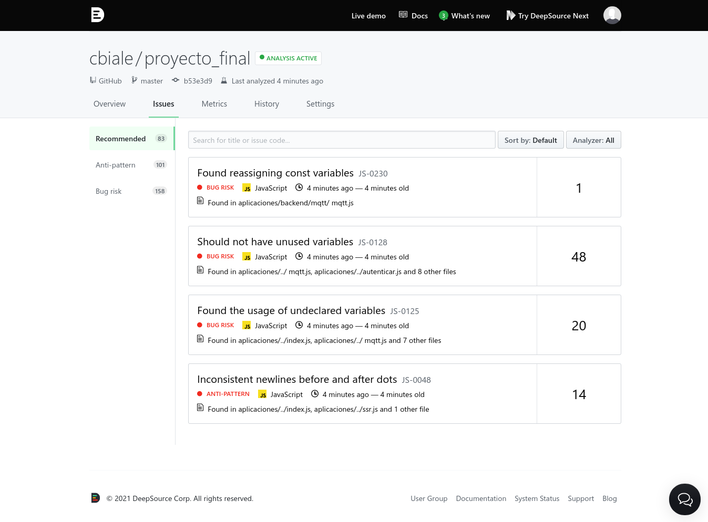

# DeepSource

## Propósito y Enlace 

Detecta código JavaScript copiado pegado y estructuralmente similar.

Enlace: [DeepSource](https://deepsource.io/)

## Configuración y ejemplo de uso

Se debe instalar `DeepSource` en `Github`, es posible en un repositorio en particular o en todos los repositorios, en la siguiente figura se puede ver que he seleccionado solo instalar en el repositorio de mi proyecto final de la especialización:

Las opciones completas en cuanto a permisos son:

Es posible determinar que *issues* son de mayor importancia:

Generar el archivo `.deepsource.toml` que debe ubicarse en el directorio raíz del proyecto, donde la herramienta detecta inicialmente de forma automática los lenguajes utilizados:

> No tiene como framework soportado a `Svelte`, por ende esos archivos no van a ser evaluados

Una vez realizado el análisis muestra una pantalla con el resultado:

En el apartado de *issues* se puede ver un detalle de cada "problema" detectado:

Divide las *issues* en:
- Recomendada
- Anti-patrón
- Riesgo de bug

Si se hace clic en alguna de las *issues* listadas se accede a un detalle de la misma, donde se muestran las ocurrencias y una descripción del problema:

