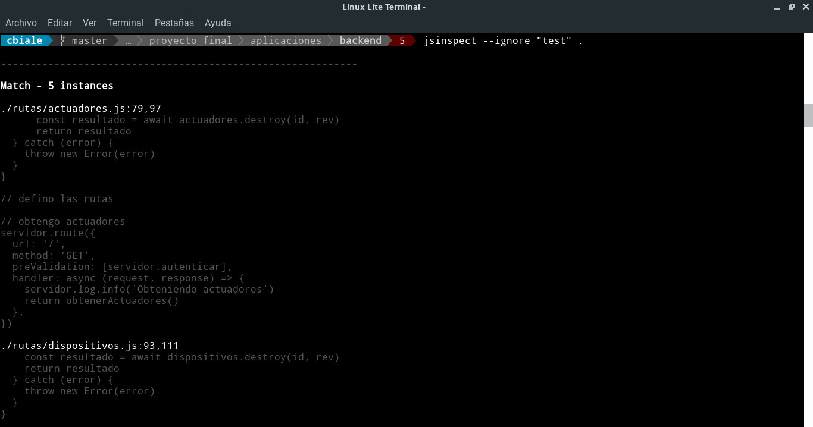

# jsinspect

## Propósito y Enlace 

Detecta código JavaScript copiado pegado y estructuralmente similar.

Enlace: [jsinspect](https://github.com/danielstjules/jsinspect)


## Instalación

```
npm install -g jsinspect
```

## Ejemplo de uso

Se muestra una captura de pantalla parcial de la ejecución de `jsinspect` en el backend desarrollado para el trabajo final de la especialización:




Se detecto código similar en: 
- la definición de rutas *(parte de GETs general)*
  - `./rutas/actuadores.js`
  - `./rutas/dispositivos.js`
  - `./rutas/reglas.js`
  - `./rutas/sensores.js`
  - `./rutas/usuarios.js`
- la definición de rutas *(parte de DELETEs)*
  - `./rutas/actuadores.js`
  - `./rutas/dispositivos.js`
  - `./rutas/reglas.js`
  - `./rutas/sensores.js`
  - `./rutas/usuarios.js`
- la definición de rutas *(parte de GETs)*
  - `./rutas/logs.js`
  - `./rutas/mediciones.js`
- la definición de rutas *(parte de POSTs)*
  - `./rutas/actuadores.js`
  - `./rutas/dispositivos.js`
  - `./rutas/reglas.js`
  - `./rutas/sensores.js`
  - `./rutas/usuarios.js`
- la definición de rutas *(parte de GETs individual)*
  - `./rutas/actuadores.js`
  - `./rutas/dispositivos.js`
  - `./rutas/reglas.js`
  - `./rutas/sensores.js`
  - `./rutas/usuarios.js`
- la definición de rutas *(parte de PUTs)*
  - `./rutas/actuadores.js`
  - `./rutas/dispositivos.js`
  - `./rutas/reglas.js`
  - `./rutas/sensores.js`
  - `./rutas/usuarios.js`
- la definición de rutas *(parte de pase a mayúsculas de datos a guardar)*
    - `./rutas/actuadores.js` *(dos lugares en inserts y updates)*
    - `./rutas/sensores.js` *(dos lugares en inserts y updates)*
- la definición de rutas *(parte de pase a mayúsculas de datos a guardar e insert)* **[REPITE PARTE]**
    - `./rutas/actuadores.js` *(dos lugares en inserts y updates)*
- la definición de rutas *(en insert y modificar)*
    - `./rutas/dispositivos.js`
- la definición de rutas *(en insert y modificar)*
    - `./rutas/reglas.js`
- gestión de MQTT *(dos insert iguales en distintas partes del código)*
    -`./mqtt/mqtt.js`

La salida completa fue:

```

------------------------------------------------------------

Match - 5 instances

./rutas/actuadores.js:79,97
      const resultado = await actuadores.destroy(id, rev)
      return resultado
  } catch (error) {
    throw new Error(error)
  }
}

// defino las rutas

// obtengo actuadores
servidor.route({
  url: '/',
  method: 'GET',
  preValidation: [servidor.autenticar],
  handler: async (request, response) => {
    servidor.log.info(`Obteniendo actuadores`)
    return obtenerActuadores()
  },
})

./rutas/dispositivos.js:93,111
    const resultado = await dispositivos.destroy(id, rev)
    return resultado
  } catch (error) {
    throw new Error(error)
  }
}

// defino las rutas

// obtengo dispositivos
servidor.route({
  url: '/',
  method: 'GET',
  preValidation: [servidor.autenticar],
  handler: async (request, response) => {
    servidor.log.info(`Obteniendo dispositivos`)
    return obtenerDispositivos()
  },
})

./rutas/reglas.js:73,91
    const resultado = await reglas.destroy(id, rev)
    return resultado
  } catch (error) {
    throw new Error(error)
  }
}

// defino las rutas

// obtengo reglas
servidor.route({
  url: '/',
  method: 'GET',
  preValidation: [servidor.autenticar],
  handler: async (request, response) => {
    servidor.log.info(`Obteniendo reglas`)
    return obtenerReglas()
  },
})

./rutas/sensores.js:80,98
      const resultado = await sensores.destroy(id, rev)
      return resultado
  } catch (error) {
    throw new Error(error)
  }
}

// defino las rutas

// obtengo sensores
servidor.route({
  url: '/',
  method: 'GET',
  preValidation: [servidor.autenticar],
  handler: async (request, response) => {
    servidor.log.info(`Obteniendo sensores`)
    return obtenerSensores()
  },
})

./rutas/usuarios.js:81,99
      const resultado = await usuarios.destroy(id, rev)
      return resultado
  } catch (error) {
    throw new Error(error)
  }
}

// defino las rutas

// obtengo usuarios
servidor.route({
  url: '/',
  method: 'GET',
  preValidation: [servidor.autenticar],
  handler: async (request, response) => {
    servidor.log.info(`Obteniendo usuarios`)
    return obtenerUsuarios()
  },
})

------------------------------------------------------------

Match - 5 instances

./rutas/actuadores.js:134,147
    return modificarActuador(request.params.id, request.body)
  },
})

// elimino un actuador (borrado lógico)
servidor.route({
  url: '/:id',
  method: 'DELETE',
  preValidation: [servidor.autenticar],
  handler: async (request, response) => {
    servidor.log.info(`Eliminando actuador, id: ${request.params.id} ${JSON.stringify(request.headers._rev)}`)
    return eliminarActuador(request.params.id, request.headers._rev)
  },
})

./rutas/dispositivos.js:148,165
    return modificarDispositivo(request.params.id, request.body)
  },
})

// elimino un dispositivo (borrado lógico)
servidor.route({
  url: '/:id',
  method: 'DELETE',
  preValidation: [servidor.autenticar],
  handler: async (request, response) => {
    servidor.log.info(
      `Eliminando dispositivo, id: ${request.params.id} ${JSON.stringify(
        request.headers._rev,
      )}`,
    )
    return eliminarDispositivo(request.params.id, request.headers._rev)
  },
})

./rutas/reglas.js:128,145
    return modificarRegla(request.params.id, request.body)
  },
})

// elimino una regla
servidor.route({
  url: '/:id',
  method: 'DELETE',
  preValidation: [servidor.autenticar],
  handler: async (request, response) => {
    servidor.log.info(
      `Eliminando regla, id: ${request.params.id} ${JSON.stringify(
        request.headers._rev,
      )}`,
    )
    return eliminarRegla(request.params.id, request.headers._rev)
  },
})

./rutas/sensores.js:135,148
    return modificarSensor(request.params.id, request.body)
  },
})

// elimino un sensor
servidor.route({
  url: '/:id',
  method: 'DELETE',
  preValidation: [servidor.autenticar],
  handler: async (request, response) => {
    servidor.log.info(`Eliminando sensor, id: ${request.params.id} ${JSON.stringify(request.headers._rev)}`)
    return eliminarSensor(request.params.id, request.headers._rev)
  },
})

./rutas/usuarios.js:136,149
    return modificarUsuario(request.params.id, request.body)
  },
})

// elimino un usuario
servidor.route({
  url: '/:id',
  method: 'DELETE',
  preValidation: [servidor.autenticar],
  handler: async (request, response) => {
    servidor.log.info(`Eliminando usuario, id: ${request.params.id} ${JSON.stringify(request.headers._rev)}`)
    return eliminarUsuario(request.params.id, request.headers._rev)
  },
})

------------------------------------------------------------

Match - 2 instances

./rutas/logs.js:81,98
    } catch (error) {
      throw new Error(error)
    }
  }
}

// defino las rutas

// obtengo logs
servidor.route({
  url: '/:id',
  method: 'GET',
  preValidation: [servidor.autenticar],
  handler: async (request, response) => {
    servidor.log.info(`Obteniendo logs, id: ${request.params.id}`)
    return obtenerLogs(request.params.id)
  },
})

./rutas/mediciones.js:53,69
  } catch (error) {
    throw new Error(error)
  }
}

// defino las rutas

// obtengo mediciones de un dispositivo
servidor.route({
  url: '/:id',
  method: 'GET',
  preValidation: [servidor.autenticar],
  handler: async (request, response) => {
    servidor.log.info(`Obteniendo mediciones, id: ${request.params.id}`)
    return obtenerMediciones(request.params.id)
  },
})

------------------------------------------------------------

Match - 5 instances

./rutas/actuadores.js:99,110
// creo un actuador
servidor.route({
  url: '/',
  method: 'POST',
  preValidation: [servidor.autenticar],
  handler: async (request, response) => {
    request.log.info(
      `Agregando actuador, datos: ${JSON.stringify(request.body)}`,
    )
    return crearActuador(request.body)
  },
})

./rutas/dispositivos.js:113,124
// creo un dispositivo
servidor.route({
  url: '/',
  method: 'POST',
  preValidation: [servidor.autenticar],
  handler: async (request, response) => {
    request.log.info(
      `Agregando dispositivo, datos: ${JSON.stringify(request.body)}`,
    )
    return crearDispositivo(request.body)
  },
})

./rutas/reglas.js:93,104
// creo una regla
servidor.route({
  url: '/',
  method: 'POST',
  preValidation: [servidor.autenticar],
  handler: async (request, response) => {
    request.log.info(
      `Agregando regla, datos: ${JSON.stringify(request.body)}`,
    )
    return crearRegla(request.body)
  },
})

./rutas/sensores.js:100,111
// creo un sensor
servidor.route({
  url: '/',
  method: 'POST',
  preValidation: [servidor.autenticar],
  handler: async (request, response) => {
    request.log.info(
      `Agregando sensor, datos: ${JSON.stringify(request.body)}`,
    )
    return crearSensor(request.body)
  },
})

./rutas/usuarios.js:101,112
// creo un usuario
servidor.route({
  url: '/',
  method: 'POST',
  preValidation: [servidor.autenticar],
  handler: async (request, response) => {
    request.log.info(
      `Agregando usuario, datos: ${JSON.stringify(request.body)}`,
    )
    return crearUsuario(request.body)
  },
})

------------------------------------------------------------

Match - 5 instances

./rutas/actuadores.js:108,121
    return crearActuador(request.body)
  },
})

// obtengo un actuador
servidor.route({
  url: '/:id',
  method: 'GET',
  preValidation: [servidor.autenticar],
  handler: async (request, response) => {
    request.log.info(`Obteniendo actuador, id: ${request.params.id}`)
    return obtenerActuador(request.params.id)
  },
})

./rutas/dispositivos.js:122,135
    return crearDispositivo(request.body)
  },
})

// obtengo un dispositivo
servidor.route({
  url: '/:id',
  method: 'GET',
  preValidation: [servidor.autenticar],
  handler: async (request, response) => {
    request.log.info(`Obteniendo dispositivo, id: ${request.params.id}`)
    return obtenerDispositivo(request.params.id)
  },
})

./rutas/reglas.js:102,115
    return crearRegla(request.body)
  },
})

// obtengo una regla
servidor.route({
  url: '/:id',
  method: 'GET',
  preValidation: [servidor.autenticar],
  handler: async (request, response) => {
    request.log.info(`Obteniendo regla, id: ${request.params.id}`)
    return obtenerRegla(request.params.id)
  },
})

./rutas/sensores.js:109,122
    return crearSensor(request.body)
  },
})

// obtengo un sensor
servidor.route({
  url: '/:id',
  method: 'GET',
  preValidation: [servidor.autenticar],
  handler: async (request, response) => {
    request.log.info(`Obteniendo sensor, id: ${request.params.id}`)
    return obtenerSensor(request.params.id)
  },
})

./rutas/usuarios.js:110,123
    return crearUsuario(request.body)
  },
})

// obtengo un usuario
servidor.route({
  url: '/:id',
  method: 'GET',
  preValidation: [servidor.autenticar],
  handler: async (request, response) => {
    request.log.info(`Obteniendo usuario, id: ${request.params.id}`)
    return obtenerUsuario(request.params.id)
  },
})

------------------------------------------------------------

Match - 5 instances

./rutas/actuadores.js:119,136
    return obtenerActuador(request.params.id)
  },
})

// modifico un actuador
servidor.route({
  url: '/:id',
  method: 'PUT',
  preValidation: [servidor.autenticar],
  handler: async (request, response) => {
    request.log.info(
      `Modificando actuador, id: ${
        request.params.id
      }, datos: ${JSON.stringify(request.body)}`,
    )
    return modificarActuador(request.params.id, request.body)
  },
})

./rutas/dispositivos.js:133,150
    return obtenerDispositivo(request.params.id)
  },
})

// modifico un dispositivo
servidor.route({
  url: '/:id',
  method: 'PUT',
  preValidation: [servidor.autenticar],
  handler: async (request, response) => {
    request.log.info(
      `Modificando dispositivo, id: ${
        request.params.id
      }, datos: ${JSON.stringify(request.body)}`,
    )
    return modificarDispositivo(request.params.id, request.body)
  },
})

./rutas/reglas.js:113,130
    return obtenerRegla(request.params.id)
  },
})

// modifico una regla
servidor.route({
  url: '/:id',
  method: 'PUT',
  preValidation: [servidor.autenticar],
  handler: async (request, response) => {
    request.log.info(
      `Modificando regla, id: ${request.params.id}, datos: ${JSON.stringify(
        request.body,
      )}`,
    )
    return modificarRegla(request.params.id, request.body)
  },
})

./rutas/sensores.js:120,137
    return obtenerSensor(request.params.id)
  },
})

// modifico un sensor
servidor.route({
  url: '/:id',
  method: 'PUT',
  preValidation: [servidor.autenticar],
  handler: async (request, response) => {
    request.log.info(
      `Modificando sensor, id: ${request.params.id}, datos: ${JSON.stringify(
        request.body,
      )}`,
    )
    return modificarSensor(request.params.id, request.body)
  },
})

./rutas/usuarios.js:121,138
    return obtenerUsuario(request.params.id)
  },
})

// modifico un usuario
servidor.route({
  url: '/:id',
  method: 'PUT',
  preValidation: [servidor.autenticar],
  handler: async (request, response) => {
    request.log.info(
      `Modificando usuario, id: ${request.params.id}, datos: ${JSON.stringify(
        request.body,
      )}`,
    )
    return modificarUsuario(request.params.id, request.body)
  },
})

------------------------------------------------------------

Match - 4 instances

./rutas/actuadores.js:36,41
const descripcion =
  parametros.descripcion.trim().charAt(0).toUpperCase() +
  parametros.descripcion.trim().slice(1).toLowerCase()
const tipo =
  parametros.tipo.trim().charAt(0).toUpperCase() +
  parametros.tipo.trim().slice(1).toLowerCase()

./rutas/actuadores.js:57,62
  const descripcion =
  parametros.descripcion.trim().charAt(0).toUpperCase() +
  parametros.descripcion.trim().slice(1).toLowerCase()
const tipo =
  parametros.tipo.trim().charAt(0).toUpperCase() +
  parametros.tipo.trim().slice(1).toLowerCase()

./rutas/sensores.js:36,41
const descripcion =
  parametros.descripcion.trim().charAt(0).toUpperCase() +
  parametros.descripcion.trim().slice(1).toLowerCase()
const metrica =
  parametros.metrica.trim().charAt(0).toUpperCase() +
  parametros.metrica.trim().slice(1).toLowerCase()

./rutas/sensores.js:57,63
const descripcion =
  parametros.descripcion.trim().charAt(0).toUpperCase() +
  parametros.descripcion.trim().slice(1).toLowerCase()

const metrica =
  parametros.metrica.charAt(0).trim().toUpperCase() +
  parametros.metrica.slice(1).trim().toLowerCase()

------------------------------------------------------------

Match - 2 instances

./rutas/actuadores.js:36,47
const descripcion =
  parametros.descripcion.trim().charAt(0).toUpperCase() +
  parametros.descripcion.trim().slice(1).toLowerCase()
const tipo =
  parametros.tipo.trim().charAt(0).toUpperCase() +
  parametros.tipo.trim().slice(1).toLowerCase()

const resultado = await actuadores.insert({
  _id: id,
  descripcion: descripcion,
  tipo: tipo,
})

./rutas/actuadores.js:57,66
  const descripcion =
  parametros.descripcion.trim().charAt(0).toUpperCase() +
  parametros.descripcion.trim().slice(1).toLowerCase()
const tipo =
  parametros.tipo.trim().charAt(0).toUpperCase() +
  parametros.tipo.trim().slice(1).toLowerCase()

const resultado = await actuadores.insert({
  _id: id,
  _rev: parametros._rev,

------------------------------------------------------------

Match - 2 instances

./rutas/dispositivos.js:35,41
async function crearDispositivo(parametros) {
  try {
    parametros.denominacion =
      parametros.denominacion.trim().charAt(0).toUpperCase() +
      parametros.denominacion.trim().slice(1).toLowerCase()
    parametros.latitud = parseFloat(parametros.latitud)
    parametros.longitud = parseFloat(parametros.longitud)

./rutas/dispositivos.js:55,61
async function modificarDispositivo(id, parametros) {
  try {
    parametros.denominacion =
      parametros.denominacion.trim().charAt(0).toUpperCase() +
      parametros.denominacion.trim().slice(1).toLowerCase()
    parametros.latitud = parseFloat(parametros.latitud)
    parametros.longitud = parseFloat(parametros.longitud)

------------------------------------------------------------

Match - 2 instances

./rutas/reglas.js:33,40
async function crearRegla(parametros) {
  try {
      parametros.descripcion =
      parametros.descripcion.trim().charAt(0).toUpperCase() +
      parametros.descripcion.trim().slice(1).toLowerCase()

    const resultado = await reglas.insert({
      descripcion: parametros.descripcion,

./rutas/reglas.js:51,58
async function modificarRegla(id, parametros) {
  try {
      parametros.descripcion =
      parametros.descripcion.trim().charAt(0).toUpperCase() +
      parametros.descripcion.trim().slice(1).toLowerCase()

    const resultado = await reglas.insert({
      _id: id,

------------------------------------------------------------

Match - 2 instances

./mqtt/ mqtt.js:296,301
await dispositivos.insert({
  _id: dispositivo._id,
  _rev: dispositivo._rev,
  denominacion: dispositivo.denominacion,
  latitud: dispositivo.latitud,
  longitud: dispositivo.longitud,

./mqtt/ mqtt.js:313,318
await dispositivos.insert({
  _id: dispositivo._id,
  _rev: dispositivo._rev,
  denominacion: dispositivo.denominacion,
  latitud: dispositivo.latitud,
  longitud: dispositivo.longitud,

11 matches found across 12 files
```
## Otras consideraciones

Aparentemente el proyecto ya no es mantenido: [https://github.com/danielstjules/jsinspect/issues/87](https://github.com/danielstjules/jsinspect/issues/87).
