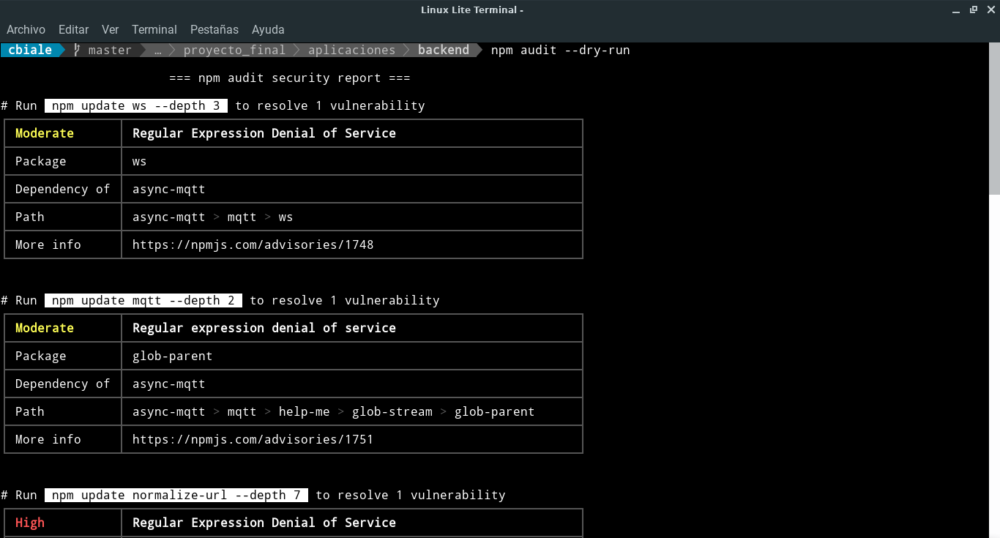

# npm-audit

## Propósito

Desde la versión 6, `npm` tiene el comando `audit`, que ofrece comprobaciones similares a las de `Dependabot`. Se está utilizando `npm` como administrador de paquetes, por ende, ejecutar el comando `npm audit` es una buena manera de asegurarse de que las dependencias de terceros estén actualizadas y sean seguras.

> En el caso de `Dependabot` genera pull request automatizados en `github`.

Dado que no es prudente actualizar automáticamente todas las dependencias, `npm audit` dispone de algunas opciones para limitar su alcance.

- `npm audit fix` actualiza automáticamente los paquetes, pero solo realiza actualizaciones secundarias *(Versiones MINOR: cuando agrega funcionalidad de una manera compatible con versiones anteriores)*.
- `npm audit fix --dry-run` genera una lista de cambios que se realizarán para que pueda verificarlos antes de que entren en vigencia.
- `npm audit fix --force`: actualiza las versiones principales *(MAJOR)* y secundarias *(MINOR)* de todos los paquetes con vulnerabilidades de seguridad.

## Ejemplo de uso

Se muestra una captura de pantalla parcial de la ejecución de `npm-check` en el backend desarrollado para el trabajo final de la especialización:

## Consideraciones adicionales

Al igual que con `Dependabot`, la `npm audit` debe combinarse con pruebas automáticas y manuales para evitar cambios que puedan romper el código.

