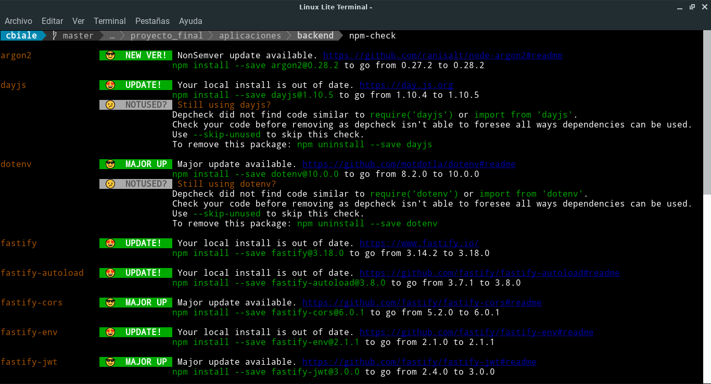

# npm-check

## Proposito y Enlace 

Comprueba si hay dependencias desactualizadas, incorrectas y no utilizadas.

Enlace: [](https://www.npmjs.com/package/npm-check)


## Instalación

```
$ npm install -g npm-check
```

## Ejemplo de uso

Se muestra una captura de pantalla parcial de la ejecución de `npm-check` en el backend desarrollado para el trabajo final de la especialización:



Es posible ejecutarlo en forma interactiva mediante el siguiente comando:

```
$ npm-check -u
```

Esto permite realizar un control e instalar nuevas versiones.

