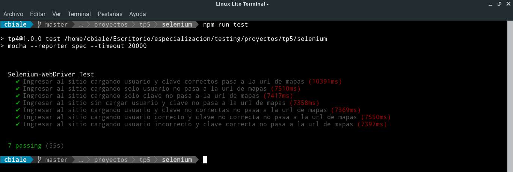
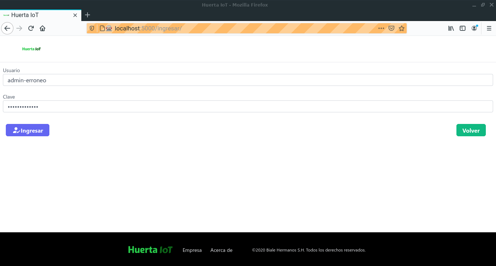

# TP5

Test de ingreso al sistema desarrollado, se usa `Firefox`, por ello se instala:

```
npm install geckodriver
```

En los test se controla:
✔ Ingresar al sitio cargando usuario y clave correctos pasa a la url de mapas

✔ Ingresar al sitio cargando solo usuario no pasa a la url de mapas

✔ Ingresar al sitio cargando solo clave no pasa a la url de mapas

✔ Ingresar al sitio sin cargar usuario y clave no pasa a la url de mapas

✔ Ingresar al sitio cargando usuario y clave no correctas no pasa a la url de mapas

✔ Ingresar al sitio cargando usuario correcto y clave no correcta no pasa a la url de mapas 

✔ Ingresar al sitio cargando usuario incorrecto y clave correcta no pasa a la url de mapas


Si bien los test pasaron, se ha verificado que los mensajes no siempre son de `"Usuario o clave incorrecto"`. Por ello se procede a modificar la API de ingreso.

Pantalla con resultados de los test y del navegador realizando las pruebas:





